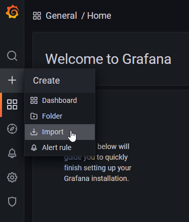
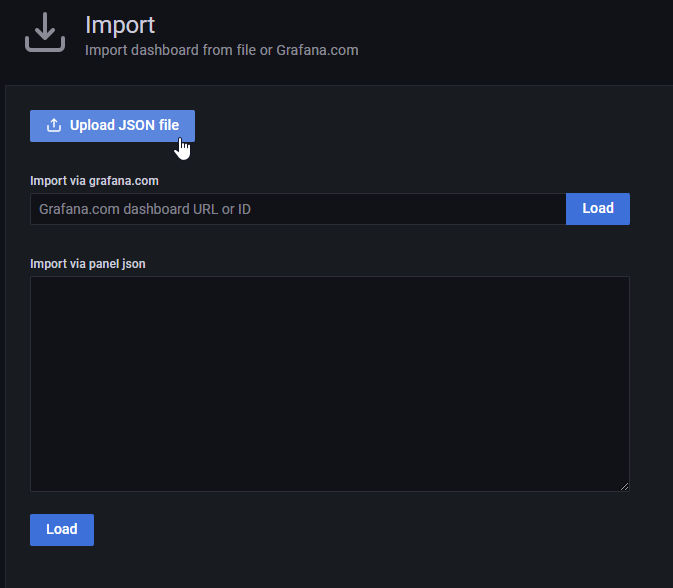

# Build the container image

docker build -t zephyr_footprint_tracking:latest Docker

# Test with Docker

The zephyr and footprint_tracking git repositories are needed to perform the import.   The container will automatically clone these repositories if they are not already present.  During testing, we can create Docker volumes to preserve this data across container runs.
```
docker volume create zephyr_repo
docker volume create footprint_tracking_repo
```

Create an envfile.txt for
```
FOOTPRINT_REPO_PATH=/data/footprint_tracking
FOOTPRINT_REPO_URL=https://github.com/robwoolley/footprint_tracking
ZEPHYR_REPO_PATH=/data/zephyr
ZEPHYR_REPO_URL=https://github.com/zephyrproject-rtos/zephyr.git
INFLUX_DB=influxdb://localhost:8086/footprint_tracking
```
NOTE (INFLUX_DB): Make sure to replace localhost:8086 with your external IP address. (eg. 192.168.10.17).  If using minikube, this can be obtained with the minikube service -all command:
```
$ minikube service --all
* service default/kubernetes has no node port
|-----------|------------|--------------|---------------------------|
| NAMESPACE |    NAME    | TARGET PORT  |            URL            |
|-----------|------------|--------------|---------------------------|
| default   | chronograf |         8888 | http://192.168.49.2:32418 |
| default   | grafana    |         3000 | http://192.168.49.2:31700 |
| default   | influxdb   |         8086 | http://192.168.49.2:31324 |
| default   | kubernetes | No node port |
|-----------|------------|--------------|---------------------------|
```

Create the footprint_tracking database in InfluxDB:
```
$ curl -i -XPOST http://192.168.10.17:8086/query --data-urlencode "q=CREATE DATABASE footprint_tracking"
HTTP/1.1 200 OK
Content-Type: application/json
Request-Id: b4d6fc7a-a2b9-11ec-8338-0242ac110005
X-Influxdb-Build: OSS
X-Influxdb-Version: 1.8.10
X-Request-Id: b4d6fc7a-a2b9-11ec-8338-0242ac110005
Date: Sun, 13 Mar 2022 10:38:22 GMT
Transfer-Encoding: chunked

{"results":[{"statement_id":0}]}
```

To run the container with Docker do:
```
docker run -it --rm --network host --env-file envfile.txt -v zephyr_repo:/data/zephyr -v footprint_tracking_repo:/data/footprint_tracking zephyr_footprint_tracking:latest
```

To confirm that data was uploaded, you can view the measurements in the footprint_tracking database by going here: http://192.168.10.17:8086/query?pretty=true&db=footprint_tracking&q=SHOW%20MEASUREMENTS

To see a sample of the data go here: http://192.168.10.17:8086/query?pretty=true&db=footprint_tracking&q=SELECT%20*%20FROM%20kernel%20LIMIT%2010

# Import Dashboards

To see the InfluxDB data, import the provided JSON files (footprint_tracking.json) into Grafana

From the Grafana toolbar, choose Create then Import


Click the button labelled Upload JSON file, choose the JSON file, then click Import

# Deploy with Kubernetes

Push your local container image to minikube.  See [here](https://minikube.sigs.k8s.io/docs/handbook/pushing/) for more information.
```
minikube image load zephyr_footprint_tracking:latest
```


```
kubectl apply -f pvc.yaml
kubectl apply -f job.yaml

```

```
kubectl delete -f pvc.yaml
```

