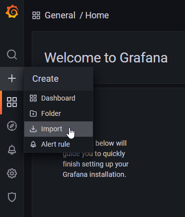
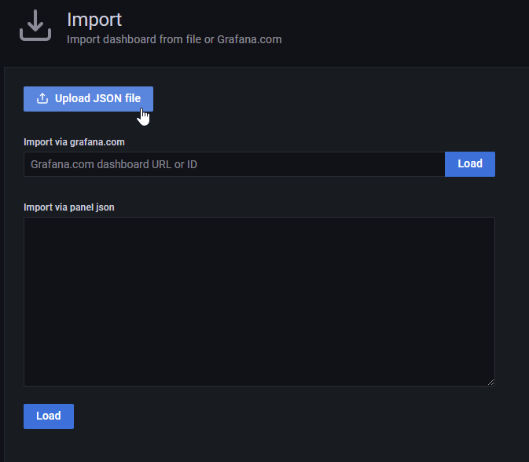

# Build the container image

docker build -t zephyr_test_results:latest .

# Test with Docker

The zephyr and test_results git repositories are needed to perform the import.   The container will automatically clone these repositories if they are not already present.  During testing, we can create Docker volumes to preserve this data across container runs.
```
docker volume create zephyr_repo
docker volume create test_results_repo
```

Create an envfile.txt for
```
RESULTS_REPO_PATH=/data/test_results
RESULTS_REPO_URL=https://github.com/zephyrproject-rtos/test_results
ZEPHYR_REPO_PATH=/data/zephyr
ZEPHYR_REPO_URL=https://github.com/zephyrproject-rtos/zephyr.git
INFLUX_DB=influxdb://localhost:8086/zephyr_test_results
```
NOTE (INFLUX_DB): Make sure to replace localhost:8086 with your external IP address. (eg. 192.168.10.17).  If using minikube, this can be obtained with the minikube service -all command:
```
$ minikube service --all
* service default/kubernetes has no node port
|-----------|------------|--------------|---------------------------|
| NAMESPACE |    NAME    | TARGET PORT  |            URL            |
|-----------|------------|--------------|---------------------------|
| default   | chronograf |         8888 | http://192.168.49.2:32418 |
| default   | grafana    |         3000 | http://192.168.49.2:31700 |
| default   | influxdb   |         8086 | http://192.168.49.2:31324 |
| default   | kubernetes | No node port |
|-----------|------------|--------------|---------------------------|
```

NOTE (RESULTS_REPO_URL): The test_results database is multiple gigabytes.  for test purposes you may wish to use a subset of the results by setting RESULTS_REPO_URL to https://github.com/robwoolley/faux_test_results.git

To run the container with Docker do:
```
docker run -it --rm --network host --env-file envfile.txt -v zephyr_repo:/data/zephyr -v test_results_repo:/data/test_results zephyr_test_results:latest
```

# Import Dashboards

To see the InfluxDB data, import the provided JSON files (overall.json, test_results.json) into Grafana

From the Grafana toolbar, choose Create then Import


Click the button labelled Upload JSON file, choose the JSON file, then click Import

# Deploy with Kubernetes

Push your local container image to minikube.  See [the minikube documentation on Pushing Images](https://minikube.sigs.k8s.io/docs/handbook/pushing/) for more information.
```
minikube image load zephyr_test_results:latest
```


```
kubectl apply -f pvc.yaml
kubectl apply -f job.yaml
```

```
kubectl delete -f pvc.yaml
```

